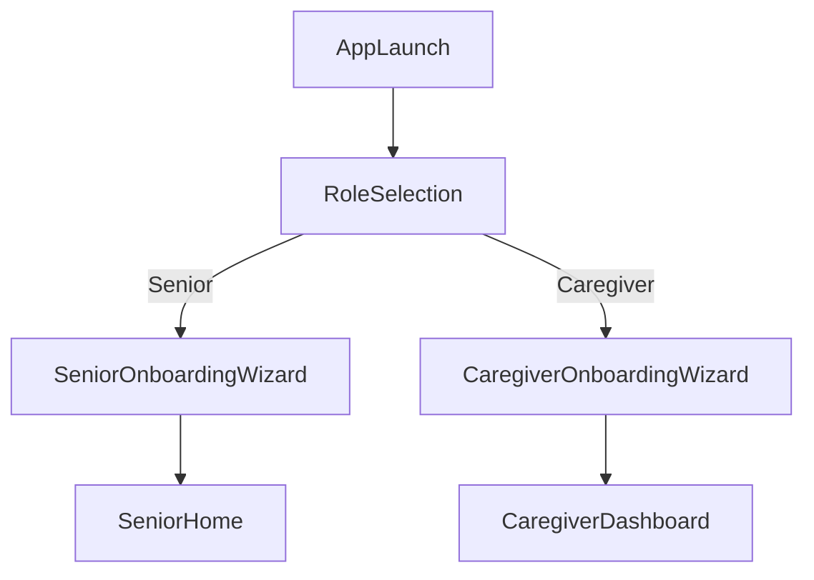

# SunSafe Check-In — User Flows

> FigJam equivalent: `SunSafe — User Flows` swimlane board.

## Entry flow

## Senior swimlane

| Step | Screen | Success | Error | Offline |
|------|--------|---------|-------|---------|
| 1 | Welcome | Next | — | — |
| 2 | Enter invite code | Join family | Invalid code snackbar | Queue join retry |
| 3 | Your name | Save name | — | Local save |
| 4 | Practice check-in | Hear success sound | — | — |
| Daily | Home | Check-in recorded | Friendly retry | Offline banner + queue |
| Daily | Celebration overlay | Auto-dismiss 2s | — | — |
| Daily | Voice note | Upload sent | Mic permission error | Queue upload |
| Daily | Need help | Dial primary contact | No contact configured | — |
| Settings | Text size / contrast / logout | Saved | — | — |

## Caregiver swimlane

| Step | Screen | Success | Error | Offline |
|------|--------|---------|-------|---------|
| 1 | Welcome | Next | — | — |
| 2 | Sign up / sign in | Account created | Human error message | — |
| 3 | Share invite code | Copy / share | — | — |
| 4 | Set deadline | Save to Firestore | Save failed retry | — |
| Daily | Dashboard | Status pill updates | Stream error skeleton | Cached last status |
| Daily | Send greeting wizard | Greeting sent | Upload error | — |
| Daily | Voice notes | Play audio free | Load error | — |
| Daily | Sentiment | Premium analysis | API error | — |
| Daily | Alert settings | CRUD contacts | Validation error | — |
| Premium | Paywall | Subscribe / restore | Offerings empty | — |

## System branches

- **Missed check-in:** Background monitor → local notification → escalation contacts if enabled
- **Low battery:** Telemetry → caregiver notification if enabled
- **Auth lost:** AuthGate → Role selection with optional error banner
